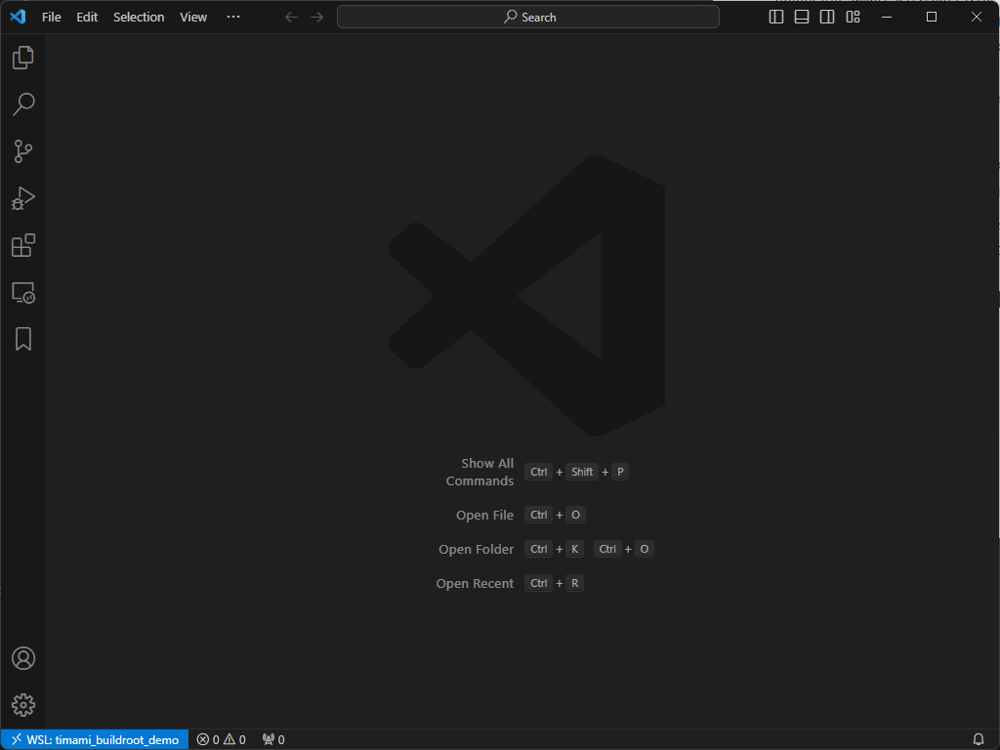
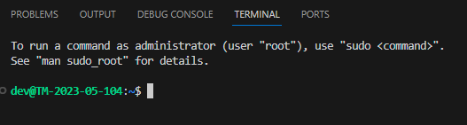

# Setting up buildroot for .NET on Windows (WSL)
## 1 Setting up a wsl for your buildroot
### 1.1 Create an empty WSL

- First we need the rootfs tarball from Ubuntu
- go to [https://cloud-images.ubuntu.com/wsl/](https://cloud-images.ubuntu.com/wsl/)
- select the  `amd64-wsl.rootfs.tar.gz` for your desired Ubuntu version
- direct link for [current Ubuntu 22.04](https://cloud-images.ubuntu.com/wsl/jammy/current/ubuntu-jammy-wsl-amd64-wsl.rootfs.tar.gz)
- setup a new wsl using the wsl exe command in powershell
```
wsl.exe --import <Distribution Name> <Install Folder> <.TAR.GZ File Path>

example:
wsl --import timami_buildroot_demo C:\WSL\TiMaMiBuildrootDemo "C:\Users\<username>\Downloads\ubuntu-jammy-wsl-amd64-wsl.rootfs.tar.gz"
```

in this way you can create multiple instances of the same linux distribution by using different distribution names and installation locations.

### 1.2 Configure your WSL

Now you can open your wsl in VSCode



- open a new Terminal 
- create a new dev user and add it to the sudo group
```
# create new user
adduser dev
# add it to sudo group
adduser dev sudo
# check if everything is correct
id dev
```
- create the file `/etc/wsl.conf` with following content:
```
# Set the user when launching a distribution with WSL.
[user]
default = dev
# Execute command upon booting
[boot]
command="service udev start"
systemd=true
# Prevent getting a path with spaces
[interop]
appendWindowsPath=false
```

run `wsl --shutdown` in your powershell to force reboot all your wsl distros
this will load your newly created `wsl.conf` and new terminals will be started as dev

### 1.3 Install dependencies for buildroot

Open your distro in VSCode again and launch a new terminal it should look something like this:


now run following command to install all required dependencies for using buildroot

```
# update package list and install dependencies
sudo apt update
sudo apt install make gcc libncurses-dev g++ unzip bc bzip2

# make git remember credentials
git config --global credential.helper store
```

## 2 Setup Buildroot environment
### 2.1 general setup
run following commands to prepare the tutorial environment
```
# create working directory
mkdir ~/tutorial
cd ~/tutorial

# clone external-timami
git clone https://github.com/TiMaMi-GmbH/buildroot-external-timami.git

# clone buildroot and switch to branch used in this tutorial (newer version might work too)
git clone https://gitlab.com/buildroot.org/buildroot.git
cd buildroot/
git checkout 2023.08.3
```

### 2.2 Setup for raspberry pi 3
open a new terminal in `~/tutorial/buildroot`

```
# define out of source output and switch to output folder
make O=../piOutput
cd ../piOutput

# connect the buildroot-external-timami to your build
make BR2_EXTERNAL=../buildroot-external-timami/

# check available defconfigs (configs from externals should be last)
make list-defconfigs

# load the defconfig for pi3 with dotnet
make defconfig raspberrypi3_64_dotnet_defconfig

# optional: configure additional packages you want to use
make menuconfig

# make your linux
make all
```

### 2.3 setup for stm32MP1 DK2
open a new terminal in `~/tutorial`

install additional library for st build
the old libssl version is no longer in ubuntu
```
wget http://archive.ubuntu.com/ubuntu/pool/main/o/openssl/libssl1.1_1.1.0g-2ubuntu4_amd64.deb 
sudo dpkg -i libssl1.1_1.1.0g-2ubuntu4_amd64.deb  
```
clone external-st and st buildroot branch

```
git clone -b st/2023.02.2 https://github.com/bootlin/buildroot-external-st.git
cd buildroot
git remote add bootlin https://github.com/bootlin/buildroot.git
git fetch -all
git switch bootlin/st/2023.02.2
```
Create Output folder and build your distribution
```
# define out of source output and switch to output folder
make O=../stmOutput
cd ../stmOutput

# connect the buildroot-external-st and buildroot-external-timami to your build
make BR2_EXTERNAL=../buildroot-external-st/:../buildroot-external-timami/

# check available defconfigs (configs from externals should be last)
make list-defconfigs

# load the defconfig for pi3 with dotnet
make defconfig st_stm32mp157f_dk2_dotnet_defconfig

# optional: configure additional packages you want to use
make menuconfig

# make your linux
make all
```

## 3 Tipps and tricks for buildroot

### 3.1 Rebuilding only target folder
If you want to reduce building times after changing your configuration for a small number of packages you can rebuild only your target folder and your packages. For this you need to delete the package folder from the output build directory. Afterwards call the following commands in your output directory:

```
# Delete target directory
rm -rf ./target
# Delete all stamps that mark that the package was installed into the target folder
find ./ -name ".stamp_target_installed" -delete
# Delete stamp from host-gcc-final to prevent missing stdlibc++
rm -f ./build/host-gcc-final-*/.stamp_host_installed
```
